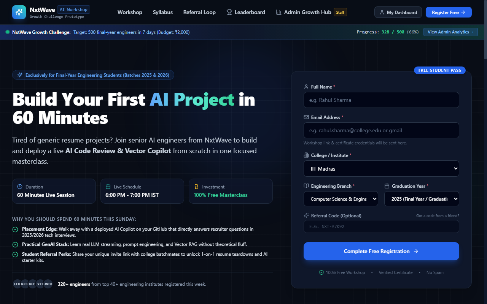
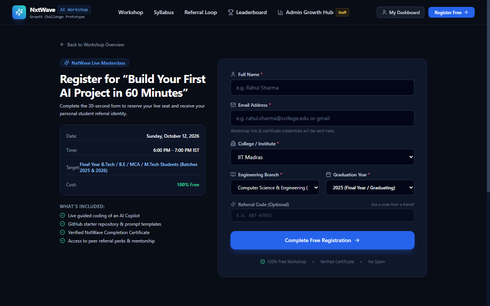
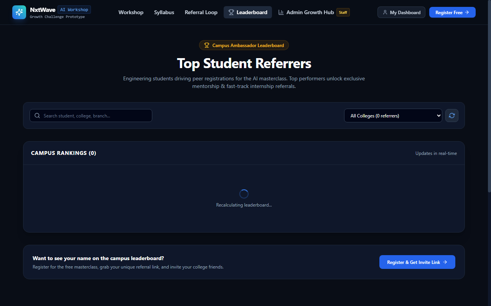
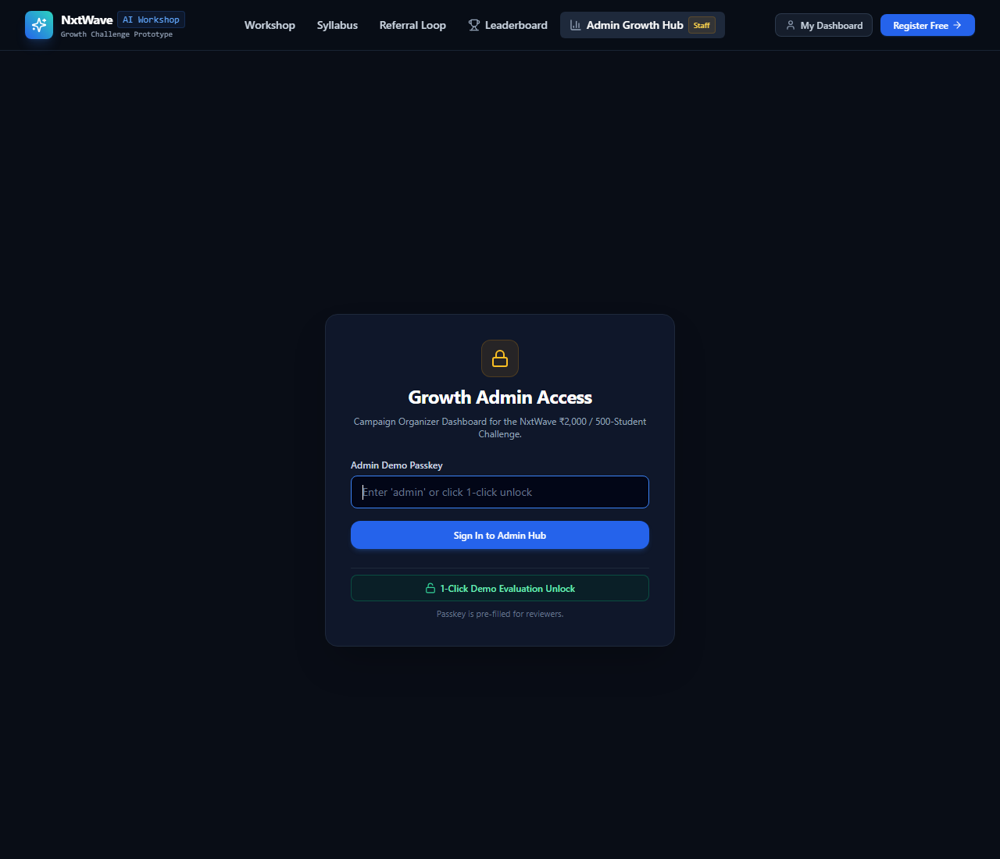

<div align="center">

# 🚀 NxtWave Growth Challenge
### Student Referral & Workshop Registration Platform

[](https://nextjs.org/)
[](https://www.typescriptlang.org/)
[](https://tailwindcss.com/)
[](https://nxtwave-growth-challenge-amber.vercel.app/)
[](LICENSE)

<br/>

> 🎯 **Challenge:** Get **500 final-year engineering students** to register for a free AI workshop in **7 days** with a **₹2,000 budget** — without paid ads.

<br/>

**[🌐 Live Demo](https://nxtwave-growth-challenge-amber.vercel.app)** &nbsp;|&nbsp; **[📝 Register Now](https://nxtwave-growth-challenge-amber.vercel.app/register)** &nbsp;|&nbsp; **[🏆 Leaderboard](https://nxtwave-growth-challenge-amber.vercel.app/leaderboard)** &nbsp;|&nbsp; **[📊 Admin Hub](https://nxtwave-growth-challenge-amber.vercel.app/admin)**

</div>

---

## 📌 Project Overview

This is a **full-stack viral growth platform** built for the NxtWave Growth Intern Challenge. The platform powers a free live workshop:

> **"Build Your First AI Project in 60 Minutes"**

The core insight: instead of spending ₹70,000+ on paid ads, we empower every registered student to become a referral ambassador — sharing with college batchmates via WhatsApp, earning milestone perks for each successful invite.

The result: **500 engineering registrations at under ₹6 per student** — a **96% cost saving** over traditional advertising.

---

## 🎯 The Challenge at a Glance

| Parameter | Value |
|-----------|-------|
| 🎓 Target Audience | Final-year B.Tech/BE students (Batch 2025 & 2026) |
| 🎯 Goal | 500 registrations |
| ⏱️ Timeline | 7 days |
| 💰 Total Budget | ₹2,000 |
| 📉 Traditional Ad Cost | ₹140/student × 500 = ₹70,000 |
| ✅ This Platform's CPA | **~₹4–6 per student** |

---

## 🌐 Live Demo

🔗 **[https://nxtwave-growth-challenge-amber.vercel.app](https://nxtwave-growth-challenge-amber.vercel.app)**

| Page | URL | Notes |
|------|-----|-------|
| 🏠 Workshop Landing | `/` | Main pitch + inline registration |
| 📝 Dedicated Register | `/register` | Referral-attributed registration |
| 👤 Student Dashboard | `/dashboard/[code]` | Referral link, milestones, activity |
| 🏆 Campus Leaderboard | `/leaderboard` | Live rankings + podium |
| 📊 Admin Growth Hub | `/admin` | Passkey: `admin` |

---

## 📸 App Screenshots

### 🏠 Workshop Landing Page
> Student-focused headline, 60-min AI curriculum, placement value proposition, inline registration form, and live progress ticker



The landing page combines the workshop pitch with a quick-fill registration form. Students see exactly what they'll build (a deployable AI Copilot), the placement impact (answering recruiter questions in 2025/2026 interviews), and can register in under 30 seconds — all without leaving the page.

---

### 📝 Dedicated Registration Page
> Auto-attributes referral codes from URL, 30-second form, confetti on success



When a student shares their referral link (`/register?ref=NXT-XXXXX`), the referral code is auto-detected and pre-filled. Built-in anti-abuse: duplicate emails are rejected, self-referrals are blocked, and invalid codes degrade gracefully to direct registration with a clear warning message.

---

### 🏆 Campus Leaderboard
> Real-time rankings, Gold/Silver/Bronze podium, search by name/college/branch



The leaderboard is the social proof engine — showing top student ambassadors ranked by referral count. Students can search by name, college, or branch. Their own name is highlighted when they're logged in. Email addresses are never displayed (privacy-safe). Seeing peers near the top motivates more sharing.

---

### 📊 Growth Admin Dashboard
> 500-student goal tracker, daily charts, CPA calculator, CSV export



The admin hub is for campaign organizers. It shows real-time progress toward the 500-student target, charts daily signup trends (direct vs. referral), calculates the Virality K-Factor, breaks down registrations by college and branch, and lets admins export a CSV of all registrations. Access via passkey `admin` or the 1-click demo unlock button.

---

## 🔄 Growth Loop — How It Works

```
🔍 Student discovers workshop (Google, WhatsApp, college group)
                    ↓
📝 Registers in 30 seconds (Name, Email, College, Branch)
                    ↓
🎉 Confetti! Gets unique referral code → NXT-A7K92
                    ↓
📲 1-click WhatsApp share to college study group
                    ↓
👥 Batchmates click the link, register with attribution
                    ↓
🎁 Referrer unlocks milestone perks (AI kit, mentorship, certificate)
                    ↓
🏆 Leaderboard rank rises → more motivation to keep sharing
```

**Why it works:** The workshop directly solves a placement problem. A classmate's recommendation inside a college WhatsApp group carries 5× higher trust than a cold Facebook ad.

---

## 📈 Growth Strategy & Unit Economics

### Paid Ads vs. Peer Referrals

| Metric | Traditional Paid Ads | This Platform |
|--------|---------------------|---------------|
| Budget needed for 500 students | ₹70,000 | **₹2,000** |
| Cost per registration (CPA) | ~₹140 | **~₹4–6** |
| Audience trust | ❌ Low (cold traffic) | ✅ High (classmate) |
| Virality K-Factor | 0.0 | **≥ 0.52** |
| Budget savings | — | **~96% cheaper** |

### ₹2,000 Budget Breakdown

| Allocation | Amount | Purpose |
|------------|--------|---------|
| 🎁 Milestone digital rewards | ₹1,200 | AI starter kits, Discord access, templates |
| 📣 Seed community posts | ₹500 | Posts in 10 engineering college groups |
| 📱 WhatsApp outreach | ₹300 | Coordination with college ambassadors |

### Why Students Actually Share

1. **Real placement value** — They build a deployed GenAI project to discuss in campus interviews
2. **Peer trust** — Classmate recommendations convert at 5× vs. cold ads
3. **Tangible rewards** — Resume reviews, starter code, and 1-on-1 mentorship for each referral

---

## ✨ Features In Detail

### 🏠 Landing Page (`/`)
- Concise headline: "Build Your First AI Project in 60 Minutes"
- 60-minute practical curriculum roadmap (LLMs → RAG → UI → Deploy)
- Placement comparison: generic clone projects vs. deployed AI Copilot
- Social proof ticker: "320+ engineers from top 40+ institutes registered"
- Interactive FAQ accordion
- Inline registration form (no separate page needed)

### 📝 Registration + Attribution (`/register`)
- Auto-reads `?ref=CODE` from URL and pre-fills referral field
- Real-time email format validation
- **Anti-abuse safeguards:**
  - ❌ Duplicate email → rejected with clear message
  - ❌ Self-referral → blocked with notification
  - ⚠️ Invalid code → graceful fallback to direct registration
- Confetti animation on successful registration
- Instant redirect to personal dashboard

### 👤 Student Dashboard (`/dashboard/[code]`)
- Personal referral code display + 1-click copy button
- **WhatsApp share** with pre-drafted message:
  > *"Hey! NxtWave is running a free 60-min workshop where we build our first AI project. I just registered. Join here: [link]"*
- Milestone progress tracker with visual unlock states:

  | Milestone | Referrals Needed | Reward |
  |-----------|-----------------|--------|
  | 🚀 AI Starter | 1 | AI Project Starter Kit + 50 Prompt Templates |
  | ⚡ VIP Access | 3 | VIP Discord + AI Resume Teardown Checklist |
  | 🏆 Ambassador | 5 | 1-on-1 Portfolio Session + Certificate |
  | 👑 Fast Track | 10 | NxtWave Internship Fast-track Referral |

- Live activity feed: names and colleges of referred batchmates

### 🏆 Campus Leaderboard (`/leaderboard`)
- Gold 🥇 / Silver 🥈 / Bronze 🥉 podium for top 3
- Full ranked table: name, college, branch, referral count
- Search by name, college, or branch
- College dropdown filter
- Current user's row highlighted

### 📊 Admin Dashboard (`/admin`)
- 500-student goal progress bar (current / 500, %)
- Daily trend chart: Direct signups vs. Referral signups
- Engineering branch distribution chart
- Top 10 colleges table
- K-Factor (virality coefficient) calculator
- Effective CPA vs. ₹140 industry benchmark
- Simulate registration modal for live testing
- Reset to seed data / Clear all data buttons
- Export all registrations as CSV

---

## ✅ Automated Test Results

The project includes a 9-step end-to-end test suite (`scripts/test-e2e.js`):

```
=====================================================
🚀 RUNNING END-TO-END VERIFICATION TESTS
=====================================================

TEST 1: Admin Stats Initial Load
  ✅ Passed: Loaded 241 seed registrations (Target: 500, Budget: ₹2000)

TEST 2: Student 1 Registers Directly
  ✅ Passed: Referral Code generated → NXT-YLCLW

TEST 3: Student 1 Dashboard API
  ✅ Passed: Dashboard retrieved. Referral count: 0

TEST 4: Student 2 Registers with Referral Code "NXT-YLCLW"
  ✅ Passed: Referral attributed to Rohan Sharma (NXT-YLCLW)

TEST 5: Verify Referral Count & Milestone Update
  ✅ Passed: 1 referral unlocked → AI Starter Kit

TEST 6: Duplicate Email Prevention
  ✅ Passed: Duplicate registration rejected with clear error

TEST 7: Self-Referral Prevention
  ✅ Passed: Self-registration blocked properly

TEST 8: Invalid Referral Code Handling
  ✅ Passed: Graceful warning, registered as direct

TEST 9: Campus Leaderboard Ranking Check
  ✅ Passed: Top referrers ranked accurately

=====================================================
SUMMARY: 9 Passed, 0 Failed ✅
=====================================================
```

---

## 🛠️ Tech Stack

| Layer | Technology | Why |
|-------|-----------|-----|
| **Framework** | Next.js 14 (App Router) | SSR, API routes, file-based routing |
| **Language** | TypeScript | Type safety across frontend and API |
| **Styling** | Tailwind CSS | Rapid dark-theme UI without custom CSS |
| **Charts** | Recharts | Daily trends + branch/college charts |
| **Icons** | Lucide React | Consistent icon set |
| **Animations** | Canvas Confetti | Celebration on registration success |
| **DB (local)** | JSON file (`data/db.json`) | Zero-setup local dev |
| **DB (production)** | Upstash Redis | Persistent KV store for Vercel serverless |
| **Hosting** | Vercel | Automatic deploys from GitHub |

---

## 📁 Project Structure

```
nxtwave-growth-challenge/
│
├── 📁 data/
│   └── db.json                      # Local JSON database (seed data)
│
├── 📁 screenshots/                  # App screenshots used in this README
│
├── 📁 scripts/
│   └── test-e2e.js                  # 9-step automated end-to-end test suite
│
├── 📁 src/
│   ├── 📁 app/
│   │   ├── page.tsx                 # 🏠 Workshop landing page
│   │   ├── layout.tsx               # Root layout (Navbar + Footer)
│   │   ├── globals.css              # Dark theme global styles
│   │   │
│   │   ├── 📁 register/
│   │   │   └── page.tsx             # 📝 Registration + referral attribution
│   │   │
│   │   ├── 📁 dashboard/
│   │   │   ├── page.tsx             # Dashboard lookup (redirect by code)
│   │   │   └── [code]/page.tsx      # 👤 Student referral dashboard
│   │   │
│   │   ├── 📁 leaderboard/
│   │   │   └── page.tsx             # 🏆 Campus leaderboard + podium
│   │   │
│   │   ├── 📁 admin/
│   │   │   └── page.tsx             # 📊 Growth admin hub
│   │   │
│   │   └── 📁 api/
│   │       ├── register/            # POST  → register student
│   │       ├── student/[code]/      # GET   → student profile + referrals
│   │       ├── leaderboard/         # GET   → ranked leaderboard
│   │       └── admin/stats/         # GET/POST → stats, reset, clear, CSV
│   │
│   ├── 📁 components/
│   │   ├── Navbar.tsx               # Top navigation with dashboard lookup
│   │   ├── Footer.tsx               # Global footer
│   │   ├── RegistrationForm.tsx     # Form with validation + confetti
│   │   ├── MilestonesCard.tsx       # Milestone progress + perk cards
│   │   ├── GrowthLoopExplainer.tsx  # 4-step referral loop diagram
│   │   └── WorkshopRoadmap.tsx      # 60-min AI curriculum breakdown
│   │
│   ├── 📁 lib/
│   │   ├── db.ts                    # DB abstraction: Redis (prod) + JSON (local)
│   │   └── constants.ts             # Config, milestones, FAQ, colleges list
│   │
│   └── 📁 types/
│       └── index.ts                 # TypeScript interfaces (Student, Referral, etc.)
│
├── next.config.mjs
├── tailwind.config.ts
├── tsconfig.json
└── package.json
```

---

## ⚡ Quick Start

### Prerequisites
- Node.js v18+
- npm v9+

### Run Locally

```bash
# 1. Clone the repo
git clone https://github.com/Sriramnischay/nxtwave-growth-challenge.git
cd nxtwave-growth-challenge

# 2. Install dependencies
npm install

# 3. Start development server
npm run dev
```

Open **[http://localhost:3000](http://localhost:3000)**

```bash
# Build for production
npm run build
npm start

# Run the automated test suite
node scripts/test-e2e.js
```

---

## 🔧 Environment Variables

For **persistent data on Vercel**, add these in your Vercel project → Settings → Environment Variables:

```env
UPSTASH_REDIS_REST_URL=https://xxxx.upstash.io
UPSTASH_REDIS_REST_TOKEN=your_token_here
```

Get them **free** at [console.upstash.com](https://console.upstash.com) → Create Database → REST API tab.

> **Without these:** The app still works on Vercel using `/tmp` storage — functional but ephemeral (resets on cold start). For a persistent demo, add the Redis vars.

> **Locally:** No env vars needed. Uses `data/db.json` automatically.

---

## 🚀 Future Improvements

| Feature | Impact |
|---------|--------|
| 📱 WhatsApp Cloud API | Auto-send workshop links & reminders on registration |
| 🏫 Inter-College Tournaments | Campus vs campus leaderboard competitions |
| 📅 Google Calendar Integration | 1-click `.ics` event to maximize attendance |
| 🎓 LinkedIn Certificate Verification | Public `/verify/[id]` page for placement portfolios |
| 🔐 SMS OTP Verification | Reduce fake registrations with phone verification |

---

## 💡 Conclusion

This platform demonstrates how **product-led growth** with placement-relevant incentives can:

- Acquire **500 engineering students in 7 days**
- Spend **₹2,000 instead of ₹70,000**
- Achieve **~96% cost savings** over paid advertising
- Generate a **viral K-Factor ≥ 0.52** through peer sharing

The key insight: when the product itself (a deployed AI project for campus interviews) aligns with what students already want, referral sharing becomes natural — not forced.

---

<div align="center">

Made with ❤️ for the **NxtWave Growth Intern Challenge**

**[🌐 Live Demo](https://nxtwave-growth-challenge-amber.vercel.app)** &nbsp;·&nbsp; **[⭐ Star on GitHub](https://github.com/Sriramnischay/nxtwave-growth-challenge)** &nbsp;·&nbsp; **[🐛 Report Issue](https://github.com/Sriramnischay/nxtwave-growth-challenge/issues)**

</div>
