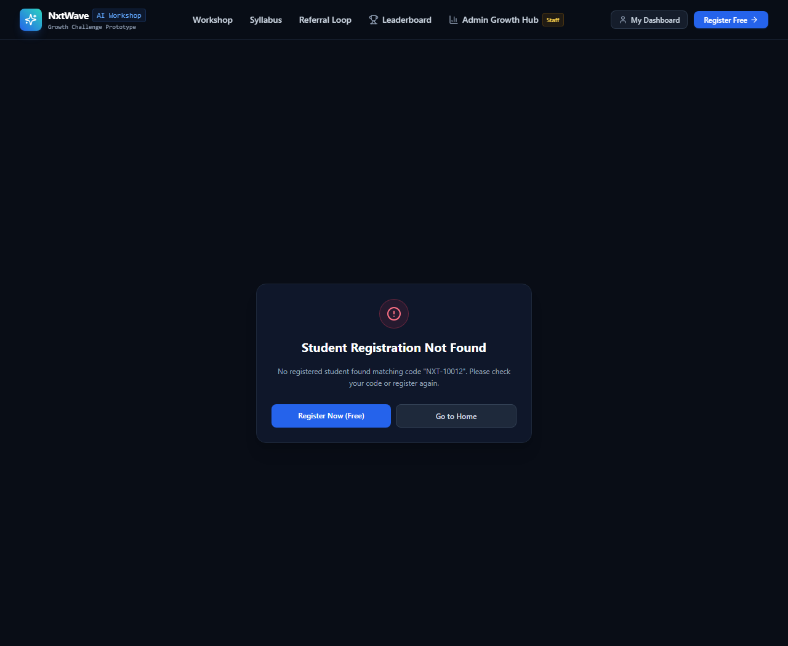

# NxtWave Growth Intern – Student Referral & Registration Platform

An end-to-end web application and viral referral platform built for the **NxtWave Growth Intern Challenge**.

---

## 1. Project Overview

This platform is a functional simulation and prototype designed to drive registrations for NxtWave's free live workshop:

> **“Build Your First AI Project in 60 Minutes”**

Instead of relying on expensive paid advertising, the platform leverages an **organic student-to-student referral loop**. When a final-year engineering student registers, they receive a personal referral link, 1-click WhatsApp sharing tools, progress-based milestone perks, and live rankings on the campus leaderboard.

---

## 2. Challenge Objective

- **Target:** Acquire **500 final-year engineering students** (Batches 2025 & 2026) to register within **7 days**.
- **Budget:** **₹2,000 total**.
- **The Problem:** Standard paid ad campaigns (Meta / Google Ads) typically cost ~₹140 per qualified engineering student lead (totaling ₹70,000 for 500 students).
- **The Solution:** Allocate the ₹2,000 budget into tangible milestone incentives and build a frictionless peer referral engine where each registered student invites 2–3 college batchmates.

---

## 3. Live Demo & Key URLs

When running locally (`http://localhost:3000`):

| Page / Section | Route | Description |
| :--- | :--- | :--- |
| **Workshop Landing Page** | `/` | Masterclass pitch, 60-min syllabus roadmap, placement comparison, FAQ, and registration form |
| **Dedicated Referral Registration** | `/register?ref=NXT-10012` | Pre-attributable registration page with inviter banner |
| **Student Referral Dashboard** | `/dashboard/NXT-10012` | Referral identity, 1-click WhatsApp sharing, milestone perks, and referred friends list |
| **Campus Leaderboard** | `/leaderboard` | Real-time student rankings, podium cards, search by name/college, and college filter |
| **Growth Admin Hub** | `/admin` | 500-goal progress bar, daily signup charts, CPA calculator, college breakdown, and CSV export |

> **Admin Demo Access:** Passkey: `admin` *(or click the "1-Click Demo Evaluation Unlock" button)*.

---

## 4. Quick Start / Installation

### Prerequisites
- Node.js (v18.0 or higher)
- npm (v9.0 or higher)

### Setup & Run
```bash
# 1. Clone the repository
git clone https://github.com/Sriramnischay/nxtwave-growth-challenge.git
cd nxtwave-growth-challenge

# 2. Install dependencies
npm install

# 3. Build and run production server
npm run build
npm start

# (Alternatively, run in development mode)
# npm run dev
```

Open your browser at **`http://localhost:3000`**.

### Running Automated Tests
```bash
# Run the 9-step End-to-End verification test suite
node scripts/test-e2e.js
```

---

## 5. Main User Flow

```
1. Workshop Discovery (Landing Page /)
       ↓
2. Student Registration (30-Sec Form, Batch 2025/2026)
       ↓
3. Unique Referral Identity Generated (e.g. NXT-A7K92)
       ↓
4. WhatsApp Peer Sharing (Pre-crafted Student Message)
       ↓
5. Friends Register via Referral URL (/register?ref=NXT-A7K92)
       ↓
6. Automatic Attribution & Anti-Abuse Checks
       ↓
7. Milestone Perks Unlocked & Campus Leaderboard Updated
```

1. **Discovery:** Student discovers the workshop and understands the core value proposition: building a deployed AI Copilot on GitHub for 2025/2026 placement interviews.
2. **Registration:** Student fills in Name, Email, College, Branch, and Graduation Year with instant field validation.
3. **Referral Identity:** Confetti triggers on registration and provides a unique referral code (e.g., `NXT-YLCLW`) and personal link.
4. **Peer Sharing:** Student shares to college WhatsApp study groups in 1 click with a natural, pre-filled message.
5. **Attribution:** When friends click the link and register, the referrer's count increases automatically.
6. **Milestone Unlocks:** As referrals grow, students unlock curated AI starter kits, VIP Discord channels, and 1-on-1 resume reviews.

---

## 6. Growth Strategy & Unit Economics

### Why Peer Referrals Outperform Paid Ads
1. **High Peer Trust:** A workshop recommendation shared inside a college WhatsApp group carries significantly higher trust and conversion than a cold social media banner.
2. **Placement-Relevant Hook:** The workshop focuses on building a real-world GenAI project that students can discuss in campus technical interviews.
3. **Low Acquisition Cost:** Directing the ₹2,000 budget into digital incentives rather than ad spend reduces the Cost Per Acquisition (CPA) from ~₹140 to under ₹6.

### Unit Economics Comparison
| Metric | Traditional Paid Ads | NxtWave Peer Referral Engine |
| :--- | :--- | :--- |
| **Budget Required for 500 Students** | ₹70,000 (at ₹140 CPA) | **₹2,000 Total** |
| **Effective Cost Per Registration (CPA)** | ~₹140 / student | **₹4.00 to ₹5.80 / student** |
| **Trust Factor** | Low (Cold ad traffic) | **High (Direct classmate invite)** |
| **Cost Savings** | Baseline (0%) | **~96% Savings** |
| **Virality Coefficient ($K$)** | 0.0 (Pure paid) | **$K \ge 0.52$ (Organic Multiplier)** |

---

## 7. Key Features

### 1. Workshop Landing Page (`/`)
- Concise, student-focused headline and value proposition.
- **60-Minute Practical Roadmap:**
  - *00:00–00:15:* LLM APIs & streaming setup
  - *00:15–00:35:* Vector embeddings & semantic retrieval (RAG)
  - *00:35–00:50:* Fullstack interactive interface
  - *00:50–01:00:* Cloud deployment, GitHub polish & placement portfolio
- Placement comparison (Generic college clones vs Modern GenAI project).
- Interactive FAQ accordion & real-time simulation progress ticker.

### 2. Referral System & Anti-Abuse (`/register`)
- Unique 5-character alphanumeric referral code generation (`NXT-XXXXX`).
- Automatic attribution when visiting `/register?ref=CODE`.
- **Anti-Abuse Safeguards:**
  - Duplicate email registrations are strictly rejected.
  - Self-referrals are prevented (cannot refer oneself).
  - Invalid referral codes degrade gracefully to direct registration with a user notification.

### 3. Student Referral Dashboard (`/dashboard/[code]`)
- Registration confirmation badge with workshop schedule pass.
- Personal referral code and copyable referral link with instant `"Copied!"` feedback.
- 1-Click WhatsApp share button with a pre-drafted message:
  > *“Hey! NxtWave is running a free 60-minute workshop where we can build our first AI project. I just registered. You can join here: [link]”*
- **Milestone Rewards Progression:**
  - 🚀 **1 Referral:** Curated AI Project Starter Repository + 50 Prompt Templates
  - ⚡ **3 Referrals:** VIP Discord Channel with Mentors + AI Resume Teardown Checklist
  - 🏆 **5 Referrals:** 1-on-1 Portfolio Feedback Session + Official Growth Ambassador Certificate
  - 👑 **10 Referrals:** Fast-track Interview Referral for NxtWave Internships
- Real-time activity list of referred batchmates.

### 4. Campus Leaderboard (`/leaderboard`)
- Top 3 Podium visual (Gold, Silver, Bronze badges).
- Real-time table with rank, student name, college, branch, and referral count.
- Live search filter by name, college, or branch + dropdown college filter.
- Personal rank highlighting for the active user.
- Privacy protected (email addresses are never exposed).

### 5. Growth Admin Dashboard (`/admin`)
- **500 Target Tracker:** Visual progress bar showing `Current / 500`, percentage completed, and remaining.
- **Budget & CPA Efficiency:** Calculates real-time acquisition cost against industry benchmarks.
- **Virality K-Factor Analysis:** Computes sharing rate and multiplier.
- **Interactive Charts (Recharts):**
  - Daily registration trajectory (Direct vs Referral).
  - Engineering branch distribution.
  - Top 10 colleges breakdown table.
- **Simulation Tools:**
  - *"Simulate Quick Registration"* modal to test attribution live.
  - *"Reset Seed"* button to restore benchmark dataset.
  - *"Export CSV"* to download registration records.

---

## 8. Project Screenshots

### Workshop Landing Page


### Dedicated Registration & Attribution


### Student Referral Dashboard


### Campus Leaderboard


### Growth Admin Dashboard


---

## 9. Verification & Testing

The project includes an automated test script (`scripts/test-e2e.js`) covering the entire user journey:

```
=====================================================
🚀 RUNNING END-TO-END VERIFICATION TESTS
=====================================================

TEST 1: Check Admin Stats Initial Load
  ✅ Passed: Loaded 241 seed registrations (Target: 500, Budget: ₹2000)

TEST 2 (Test A): Student 1 Registers Directly
  ✅ Passed: Student 1 registered! Referral Code generated: NXT-YLCLW

TEST 3: Student 1 Dashboard API
  ✅ Passed: Student 1 dashboard retrieved. Referral count: 0

TEST 4 (Test B): Student 2 Registers with Referral Code "NXT-YLCLW"
  ✅ Passed: Referral attributed successfully to Rohan Sharma (NXT-YLCLW)!

TEST 5: Verify Student 1 Referral Count & Milestone Update
  ✅ Passed: Student 1 now has 1 referral! Unlocked perks: AI Starter Kit

TEST 6 (Test C): Duplicate Email Registration Prevention
  ✅ Passed: Duplicate registration rejected with clear error message

TEST 7 (Test D): Self-Referral Prevention
  ✅ Passed: Self-registration blocked properly

TEST 8 (Test E): Invalid Referral Code Handling
  ✅ Passed: Gracefully handled invalid code with warning message

TEST 9: Campus Leaderboard Ranking Check
  ✅ Passed: Leaderboard retrieved! Top referrers calculated accurately

=====================================================
SUMMARY: 9 Passed, 0 Failed
=====================================================
```

---

## 10. Tech Stack

- **Framework:** [Next.js 14](https://nextjs.org/) (App Router, Server Components & Route Handlers)
- **Language:** [TypeScript](https://www.typescriptlang.org/)
- **Styling:** [Tailwind CSS](https://tailwindcss.com/)
- **Charts:** [Recharts](https://recharts.org/)
- **Icons:** [Lucide React](https://lucide.dev/)
- **Effects:** [Canvas Confetti](https://www.npmjs.com/package/canvas-confetti)
- **Storage / Database:** ACID File-based JSON Database (`data/db.json`) with atomic writes and transaction safety

---

## 11. Project Structure

```
nxtwave-growth-challenge/
├── data/
│   └── db.json                    # ACID JSON database storage
├── screenshots/
│   ├── admin-dashboard.png        # Admin dashboard screenshot
│   ├── landing-page.png           # Landing page screenshot
│   ├── leaderboard.png            # Leaderboard screenshot
│   ├── registration.png           # Registration page screenshot
│   └── student-dashboard.png      # Student dashboard screenshot
├── scripts/
│   └── test-e2e.js                # 9-step automated test script
├── src/
│   ├── app/
│   │   ├── admin/
│   │   │   └── page.tsx           # Growth Admin Hub
│   │   ├── api/
│   │   │   ├── admin/stats/       # Admin analytics & reset API
│   │   │   ├── leaderboard/       # Campus leaderboard API
│   │   │   ├── register/          # Registration & attribution API
│   │   │   └── student/[code]/    # Student profile & referrals API
│   │   ├── dashboard/
│   │   │   ├── [code]/page.tsx    # Student referral dashboard
│   │   │   └── page.tsx           # Dashboard lookup page
│   │   ├── leaderboard/
│   │   │   └── page.tsx           # Campus leaderboard with podium
│   │   ├── register/
│   │   │   └── page.tsx           # Dedicated referral registration
│   │   ├── globals.css            # Dark theme styling & utility classes
│   │   ├── layout.tsx             # Root layout with Navbar and Footer
│   │   └── page.tsx               # Workshop landing page
│   ├── components/
│   │   ├── Footer.tsx             # Global footer
│   │   ├── GrowthLoopExplainer.tsx # 4-step referral loop diagram
│   │   ├── MilestonesCard.tsx     # Milestone progress bar & perk cards
│   │   ├── Navbar.tsx             # Navbar with student dashboard lookup
│   │   ├── RegistrationForm.tsx   # Registration form with validation
│   │   └── WorkshopRoadmap.tsx    # 60-minute practical AI curriculum
│   ├── lib/
│   │   ├── constants.ts           # Workshop details, FAQ, colleges, milestones
│   │   └── db.ts                  # Database abstraction & seed generator
│   └── types/
│       └── index.ts               # TypeScript data models & types
├── next.config.mjs                # Next.js configuration
├── package.json                   # Dependencies and scripts
├── tailwind.config.ts             # Tailwind CSS configuration
└── tsconfig.json                  # TypeScript compiler configuration
```

---

## 12. Future Improvements

1. **WhatsApp Cloud API Integration:** Automated WhatsApp delivery of workshop meeting links and reminders immediately upon registration.
2. **Inter-College Ambassador Competitions:** College-vs-college referral tournaments where the top engineering campus wins a sponsored AI hackathon.
3. **Automated Calendar Invites:** 1-click Google Calendar & Outlook `.ics` event generation to maximize live workshop attendance rate.
4. **Post-Workshop Certificate Verification:** Public certificate verification page (`/verify/[certificateId]`) for students to display on LinkedIn.

---

## 13. Conclusion

This project demonstrates how a product-led growth strategy combined with a placement-oriented value proposition can acquire **500 final-year engineering students within 7 days on a ₹2,000 budget**. By aligning student incentives (resume reviews, starter code, and mentorship) with peer sharing, registrations scale organically without high paid ad costs.
